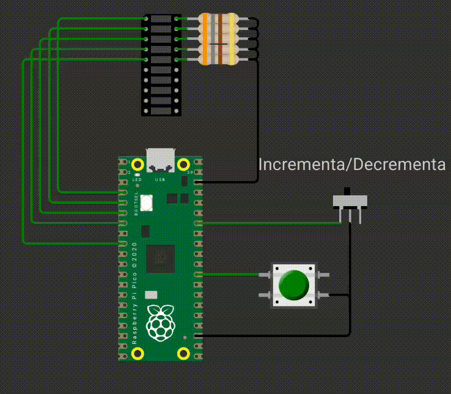

# EXE1

Neste exercício, você deve desenvolver um firmware que:

A chave SW controla se o botão irá incrementar o contador exibido na barra de LED ou se irá decrementar.

- SW = 0 (nível baixo) → incrementar.
- SW = 1 (nível alto) → decrementar.

Toda vez que o botão verde for apertado a barra de LED deve incrementar/decrementar de acordo com a configuração da chave.

E possui as seguintes funções:

- `bar_init()`: inicializa os pinos da barra de pino
- `bar_display(int val)`: Ao receber um valor inteiro de `0..5` preenche os LEDs da barra.

## Detalhes do firmware:

- Baremetal (sem RTOS).
- Deve passar nos testes `embedded_check`, `cpp_check` e `rubric_check`.
- Deve trabalhar com interrupções nos botões.  
- Não é permitido usar `gpio_get()`.
- Deve implementar e usar as funções `bar_init()`, `bar_display(init val)`

## Testes

O código deve passar em todos os testes para ser aceito:

- `embedded_check`
- `firmware_check`
- `wokwi`

Caso acredite que o seu código está funcionando, porém os testes estão falhando, preencha o forms:

[Google forms para revisão manual](https://docs.google.com/forms/d/e/1FAIpQLSdikhET4iqFwkOKmgD-G6Ri-2kCdhDLndlFWXdfdcuDfPnYHw/viewform?usp=dialog)
