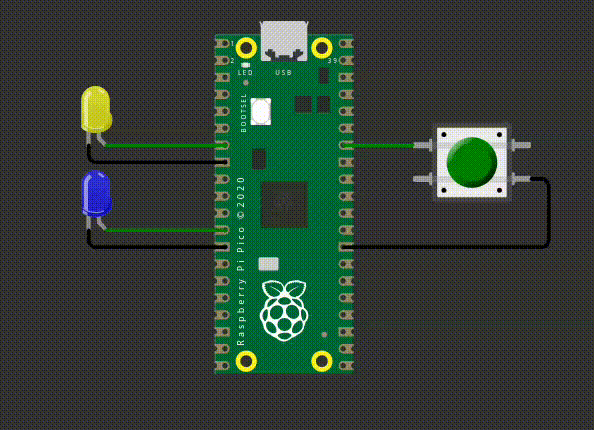

# EXE2

Neste exercício, vocês utilizarão o periférico de **timer** para piscar os dois LEDs, os mesmos devem começar começar a piscar quando o botão for pressionado e devem piscar por 1 segundo, depois devem parar. 

O período que cada LED deve piscar é:

- Led amarelo: 300ms
- Led azul: 150ms

**Detalhes do firmware:**

- Baremetal (sem RTOS).
- Deve trabalhar usar **TRÊS** timers: um para o LED amarelo, outro para o Azul e outro para o alarme que irá contar 1 segundo.
- Deve trabalhar com interrupções nos botões.  
- Não é permitido usar `sleep_ms(), sleep_us(), get_absolute_time()`.
- **printf** pode atrapalhar o tempo de simulação, comenta/remova antes de testar.

## Testes

O código deve passar em todos os testes para ser aceito:

- `embedded_check`
- `firmware_check`
- `wokwi`

Caso acredite que o seu código está funcionando, só que os testes falham, preencha o forms:

[Google forms para revisão manual](https://docs.google.com/forms/d/e/1FAIpQLSdikhET4iqFwkOKmgD-G6Ri-2kCdhDLndlFWXdfdcuDfPnYHw/viewform?usp=dialog)

