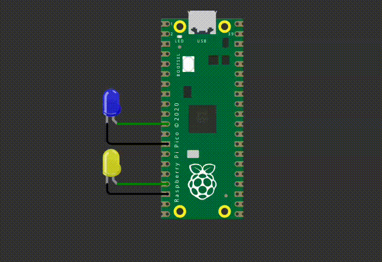
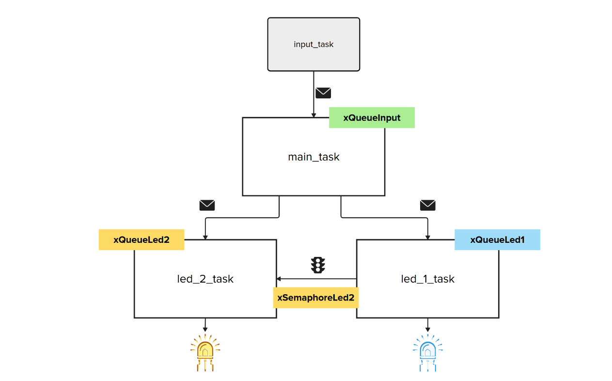
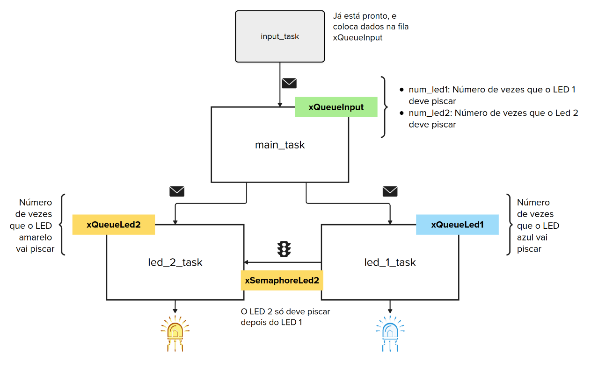

# EXE3



Neste exercício você deve utilizar o `RTOS` para fazer dois LEDs piscarem de forma coordenada, controlado por dados que chegam em uma fila. 

**Detalhes de funcionalidade:**

Os dados de entrada chegam por uma fila chamada `xQueueInput`, que já está implementada no código base e possui elementos de uma struct: 

```
 typedef struct input {
     int num_led1;
     int num_led2;
 } input_t;
```

onde:
- `num_led1`: Define quantas vezes o led azul deve piscar
- `num_led2`: Define quantas vezes o led amarelo deve piscar

O código base também possui uma `input_task` que alimenta essa fila. Você **`NÃO`** deve se preocupar em colocar dados da fila, apenas tirar! Sua tarefa é:

- Ler a fila `xQueueInput`;
- Distribuir os dados para as tasks dos LEDs;
- Garantir que o LED amarelo só pisque após o LED azul terminar.

Você deve criar um sistema de acordo com o diagrama a seguir:



onde:

- `main_task`: Task que lê a fila `xQueueInput` e envia os dados para duas filas auxiliares: `xQueueLed1` e `xQueueLed2`.
- `xQueueLed1`: Indica quantas vezes o LED azul deve piscar
- `xQueueLed2`: Indica quantas vezes o LED amarelo deve piscar
- `xSemaphoreLed2`: Semáforo que garante que o LED amarelo só vai piscar depois do LED azul.
- `led_1_task`: Task que faz o LED Azul piscar o número de piscadas da `xQueueLed1` com intervalo de 250ms.
- `led_2_task`: Task que faz o LED Amarelo piscar o número de piscadas da `xQueueLed2` com intervalo de 250ms. **Atenção: somente depois do LED azul parar**

**Detalhes do firmware:**



- Utulizar `RTOS`.
- Seguir estrutura proposta do firmware.
- Utilizar período de 250 ms para piscar os LEDs.
- **printf** pode atrapalhar o tempo de simulação, comenta antes de testar.

## Testes

O código deve passar em todos os testes para ser aceito:

- `embedded_check`
- `firmware_check`
- `wokwi`

Caso acredite que o seu código está funcionando, só que os testes falham, preencha o forms:

[Google forms para revisão manual](https://docs.google.com/forms/d/e/1FAIpQLSdikhET4iqFwkOKmgD-G6Ri-2kCdhDLndlFWXdfdcuDfPnYHw/viewform?usp=dialog)
